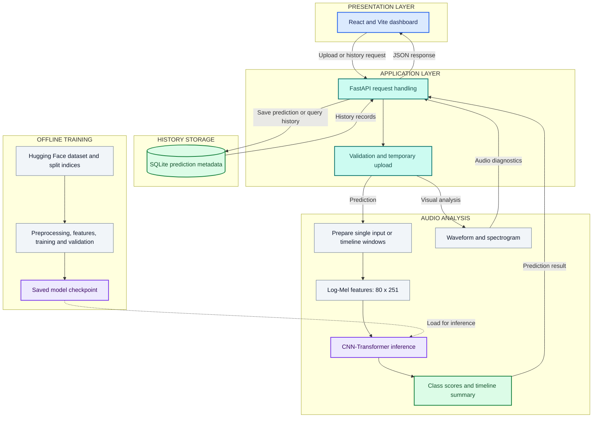

# AI Voice vs Real Voice Prediction

### AI Voice vs Real Voice Prediction

VoiceGuard AI is a full-stack audio analysis system that predicts whether an uploaded speech recording is **REAL** or **AI-GENERATED**. It combines a React dashboard, a FastAPI inference service, log-Mel spectrogram features, and a PyTorch CNN–Transformer classifier.

> Final-year academic project | B.Tech Computer Science & Engineering (Data Science)

The application is designed as an analysis aid. Its confidence score is the model's output for the supplied recording; it is not a calibrated probability, a legal authenticity certificate, or a universal accuracy claim.

## Watch the demo

**[Watch the project demo on YouTube](https://youtu.be/b05BEmNYW-I)** · **[Explore the source code](https://github.com/tulsibhelkar/AI-Voice-vs-Real-Voice-Prediction)**

## Project overview

Synthetic speech is becoming easier to create and harder to identify by listening alone. VoiceGuard AI extracts acoustic patterns from a recording and presents the prediction together with audio diagnostics such as duration, sample rate, waveform, log-Mel visualization, class scores, and—when requested—an overlapping prediction timeline.

The system supports two complementary views:

- **Single prediction:** one four-second model input produces a REAL or AI-GENERATED result.
- **Prediction timeline:** the audio is analyzed in four-second windows with a two-second step. Window scores are averaged to produce the combined result and displayed for inspection.

Timeline windows describe model behavior over time. They do not prove the exact location of an edit or imply that a percentage of the speech is AI-generated.

## Key features

- Upload WAV, FLAC, or MP3 audio from a responsive React interface.
- FastAPI endpoints for prediction, audio visualization, timeline analysis, and history.
- Mono conversion, 16 kHz resampling, silence trimming, peak normalization, and fixed-length padding/cropping.
- Log-Mel spectrogram extraction with an `80 × 251` feature representation.
- CNN–Transformer binary classifier with explicit REAL and AI-GENERATED class scores.
- Overlapping-window timeline analysis using mean class-score aggregation.
- SQLite-backed prediction history.
- Separate frontend, backend, model, preprocessing, and data-split layers for reproducible development.

## System architecture

The application separates the user interface, API, audio analysis, storage, and offline training. The trained checkpoint connects the training workflow to inference.

*Figure 1. VoiceGuard AI system architecture. The frontend communicates with FastAPI; database access and model inference remain on the backend.*

| Component | Responsibility |
|---|---|
| React + Vite | Audio upload, prediction display, visualizations, timeline, and history |
| FastAPI | Validate uploads, invoke services, manage temporary files, and return JSON |
| Audio processing | Prepare a four-second input for single prediction, or overlapping four-second windows with a two-second step for timeline analysis |
| Log-Mel features | Convert each model input into an 80 x 251 time-frequency representation |
| CNN-Transformer | Produce REAL and AI-GENERATED class scores |
| Timeline summary | Average the class scores of analyzed windows |
| SQLite | Store and retrieve prediction metadata through the backend |
| Offline training | Train and validate the model, then save the checkpoint used for inference |

The audio visualizations are generated separately from classification. They show the input signal, not a verified explanation of the classifier's decision. Timeline scores are window-level predictions, not exact manipulation boundaries.

## How prediction works

1. The frontend sends an audio file to the FastAPI backend.
2. The backend loads the recording as mono audio at 16 kHz.
3. Leading and trailing silence is trimmed using a 30 dB threshold.
4. The waveform is peak-normalized and padded or cropped to 4 seconds (64,000 samples).
5. A log-Mel spectrogram is extracted using 80 Mel bands, a 1,024-point FFT, and a 256-sample hop length.
6. The CNN learns local time–frequency patterns and the Transformer models relationships across the spectrogram sequence.
7. Softmax class scores are returned as REAL or AI-GENERATED with the model confidence.

## Model and data

### Model

| Item | Configuration |
|---|---|
| Architecture | CNN–Transformer (`CNNTransformer`) |
| Task | Two-class audio classification |
| Class `0` | REAL |
| Class `1` | AI-GENERATED |
| Input sample rate | 16,000 Hz |
| Model duration | 4 seconds |
| Features | Log-Mel spectrogram |
| Feature shape | `80 × 251` |
| Inference output | Label, confidence, and class probabilities |

### Dataset

Training uses the Hugging Face dataset [`garystafford/deepfake-audio-detection`](https://huggingface.co/datasets/garystafford/deepfake-audio-detection). The project stores split indices in `data/splits/` so the same train/validation partition can be reused.

Raw audio is not included in this repository. Review the dataset's license and terms before using it outside an academic setting.

## Repository structure

~~~text
AI-Voice-vs-Real-Voice-Prediction/
├── backend/
│   ├── api/
│   │   └── audio_analysis.py       # Waveform and spectrogram analysis
│   ├── database/
│   │   └── database.py             # SQLite history operations
│   ├── uploads/                    # Temporary uploads (ignored by Git)
│   └── main.py                     # FastAPI application
├── frontend/
│   ├── src/
│   │   ├── App.jsx                 # Dashboard, analyzer, history, model pages
│   │   └── ...
│   ├── package.json
│   └── vite.config.*
├── training/
│   ├── config.py
│   ├── dataloader.py
│   ├── dataset.py
│   ├── features.py
│   ├── model_cnn_transformer.py
│   ├── predict.py
│   ├── preprocess.py
│   ├── train.py
│   └── ...
├── data/
│   └── splits/                      # Reusable JSON split indices
├── saved_models/
│   └── cnn_transformer_final.pth    # Trained checkpoint, if included
├── requirements.txt
├── .env.example
├── .gitignore
└── README.md
~~~

## Local setup

### 1. Clone the repository

~~~bash
git clone https://github.com/tulsibhelkar/AI-Voice-vs-Real-Voice-Prediction.git
cd AI-Voice-vs-Real-Voice-Prediction
~~~

### 2. Create the Python environment

Windows Command Prompt:

~~~cmd
python -m venv venv
venv\Scripts\activate
python -m pip install --upgrade pip
pip install -r requirements.txt
~~~

macOS/Linux:

~~~bash
python3 -m venv venv
source venv/bin/activate
python -m pip install --upgrade pip
pip install -r requirements.txt
~~~

### 3. Configure the frontend

Create a file named `frontend/.env`:

~~~env
VITE_API_URL=http://127.0.0.1:8000
~~~

If the current frontend uses a fixed API URL, keep the existing URL in its API service file or update it to read `import.meta.env.VITE_API_URL`.

### 4. Start the FastAPI backend

From the project root:

~~~cmd
venv\Scripts\activate
python -m uvicorn backend.main:app --reload
~~~

The API is available at `http://127.0.0.1:8000`. Interactive API documentation is available at `http://127.0.0.1:8000/docs`.

### 5. Start the React frontend

Open a second terminal:

~~~cmd
cd frontend
npm install
npm run dev
~~~

Open the URL printed by Vite, usually `http://localhost:5173`.

## API reference

| Method | Endpoint | Purpose |
|---|---|---|
| `GET` | `/` | Confirm that the API is running |
| `GET` | `/health` | Health check |
| `POST` | `/predict` | Classify one uploaded audio file |
| `POST` | `/predict-timeline` | Return overlapping window predictions |
| `POST` | `/analyze-audio` | Return waveform, spectrogram, and audio details |
| `GET` | `/history` | Read saved prediction history |

Example request from Windows:

~~~cmd
curl.exe -X POST "http://127.0.0.1:8000/predict" -F "file=@data/challenge/known_ai.flac"
~~~

Illustrative single-prediction response (values are examples, not benchmark results):

~~~json
{
  "filename": "sample.flac",
  "prediction": "AI-GENERATED",
  "confidence": 82.0
}
~~~

The displayed confidence is model output for that file. It should not be interpreted as a general test-set accuracy value.

## Training

Training requires the Hugging Face dataset, valid split files, and the dependencies in `requirements.txt`.

~~~cmd
venv\Scripts\activate
python -m training.train
~~~

The trained checkpoint is written to:

~~~text
saved_models/cnn_transformer_final.pth
~~~

The training script shown for this project writes to that checkpoint path. Back up an existing checkpoint before retraining so you do not overwrite the model currently used by the application.

Do not commit private recordings, credentials, virtual environments, or generated upload files. If the model checkpoint exceeds GitHub's normal file limit, use Git LFS or publish it as a release asset.

## Responsible interpretation

This project is a research prototype, not a forensic certification tool. Performance can change with speaker identity, language, microphone, compression, background noise, sample rate, and an AI generator that was not represented during training.

The current project does not make a universal accuracy claim. A small local comparison set is not enough to estimate real-world performance, and timeline segments should not be presented as exact manipulation boundaries. For a stronger research result, evaluate on speaker-disjoint and generator-disjoint recordings with a larger, documented test protocol.

## Roadmap

- Expand the evaluation protocol with unseen speakers, codecs, languages, and TTS generators.
- Add calibrated confidence and an abstain/uncertain result for low-confidence inputs.
- Compare the CNN–Transformer with pretrained audio encoders.
- Add data augmentation for noise, reverberation, resampling, and compression.
- Add explainability views such as spectrogram saliency or attention summaries.
- Package the model with a reproducible deployment configuration.

## Citation and references

- [Hugging Face Datasets](https://huggingface.co/docs/datasets)
- [PyTorch](https://pytorch.org/docs/stable/index.html)
- [Librosa](https://librosa.org/doc/latest/index.html)
- [FastAPI](https://fastapi.tiangolo.com/)
- [React](https://react.dev/)
- [Vite](https://vite.dev/)

## Author

**Tulsi Gopalkrishna Bhelkar**  
B.Tech Computer Science & Engineering (Data Science)

[GitHub repository](https://github.com/tulsibhelkar/AI-Voice-vs-Real-Voice-Prediction) · [YouTube demo](https://youtu.be/b05BEmNYW-I)

